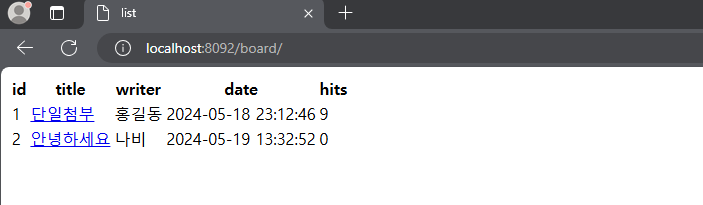

# spring-board
- 강의명: 스프링부트 게시판 프로젝트
- 코딩레시피
- 날짜: 2024.05.02 ~ 05.19
- 강의 유튜브
---
# 개발 환경
1. IDE: IntelliJ IDEA Ultimate
2. Spring Boot
3. JDK 17
4. mysql
5. Spring Data Jpa
6. Thymeleaf
---
# 게시판 주요기능
1. 글쓰기(/board/save)
2. 글목록(/board/)
3. 글조회(/board/{id})
4. 글수정(/board/update/{id})
    - 상세화면에서 수정 버튼 클릭
    - 서버에서 해당 게시글의 정보를 가지고 수정 화면 출력
    - 제목, 내용, 수정 입력 받아서 서버로 요청
    - 수정 처리
5. 글삭제(/board/delete/{id})
6. 페이징처리(/board/paging)
    - /board/paging?/page=2
    - /board/paging/2
    - 게시글 14
      - 한 페이지에 5개씩 => 3개
      - 한 페이지에 3개씩 => 5개
7. 파일(이미지)첨부하기
    - 단일 파일 첨부
    - 다중 파일 첨부
    - 파일 첨부와 관련하여 추가될 부분들
      - save.html
      - BoardDTO
      - BOARDService.save()
      - BoardEntity
      - BoardFileEntity, BoardFileRepository 추가
      - detail.html
8. 댓글처리
    - 글 상세 페이지에서 댓글 입력 (ajax)
        - ajax 다뤄보기 재생목록
    - 상세조회할 때 기존에 작성된 댓글 목록 보임
    - 댓글 입력하면 기존 댓글 목록에 새로 작성한 댓글 추가
    - 댓글용 테이블 필요
---

- 메인 화면
 

- 글 작성

- 글 목록

- 상세화면

- 댓글 작성

- 페이징